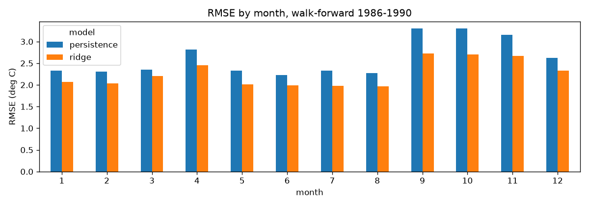

# MLOps: Daily Temperature Forecasting


End-to-end MLOps around a deliberately simple model: versioned data, tracked experiments,
a reproducible pipeline, a tested and containerized FastAPI service, CI/CD, local
Prometheus and Grafana monitoring with drift checks on logged requests, and a live cloud
deployment. The service forecasts the next day's minimum temperature
for Melbourne from the last 30 days of readings.

## Live demo

- Web UI: https://temperature-forecast-api-mejw.onrender.com (type a place name, get the forecast)
- Interactive docs: https://temperature-forecast-api-mejw.onrender.com/docs
- Health: https://temperature-forecast-api-mejw.onrender.com/health

The service runs on Render's free tier, so the first request after a period of idleness
takes up to a minute while the instance wakes up.

```bash
curl -X POST https://temperature-forecast-api-mejw.onrender.com/predict \
  -H "Content-Type: application/json" \
  -d '{"date": "1991-01-01", "recent_temps": [12.0, 11.5, 13.2, 12.8, 14.0, 13.1, 12.2, 11.9, 12.5, 13.0, 12.7, 11.8, 12.1, 13.4, 12.9, 12.3, 11.7, 12.6, 13.3, 12.0, 11.6, 12.4, 13.5, 12.8, 12.2, 11.9, 12.7, 13.1, 12.5, 12.0]}'
```

`recent_temps` holds the last 30 daily minimums, newest first (index 0 is yesterday).

## Architecture

```
public CSV (GitHub raw URL)
        |  python -m src.data.ingest
        v
data/raw  (tracked by DVC, not Git)
        |  dvc repro: prepare -> train, backtest -> error_analysis
        v
data/processed/features.csv  ->  Ridge        ->  models/model.pkl + metrics.json
        |                         (params.yaml, every run logged to MLflow)
        v
FastAPI service  /health  /predict  /metrics      <- Docker image, model baked in at build
        |
        |  push to main
        v
GitHub Actions  CI (ruff, black, pytest)  ->  CD (build image, push to GHCR)
        |
        v
Render  (render.yaml blueprint, auto-deploys main, health-checked rollout)
```

CI and CD are separate workflows on purpose: CI protects `main` (nothing merges without a
green check), CD ships whatever lands on `main`.

## Tech stack

| Role | Tool | Why |
|---|---|---|
| Language | Python 3.11 | Universal in ML, fast, supported by every tool below |
| Modeling | pandas, scikit-learn | CPU-only and reliable; the pipeline is the point, not the model |
| Data versioning and pipeline | DVC | Git-like data tracking and a pipeline DAG in one tool |
| Experiment tracking | MLflow | Params, metrics, and model artifacts for every run |
| Serving | FastAPI, Pydantic, uvicorn | Typed, validated contracts with auto-generated docs |
| Quality | pytest, Ruff, Black, pre-commit | Fast tests, fast lint, no formatting debates |
| Packaging | Docker (multi-stage), docker-compose | Identical runtime on laptop, CI, and cloud |
| CI/CD | GitHub Actions, GHCR | Native to the repo; images tagged `latest` and `sha-<commit>` |
| Monitoring | Prometheus, Grafana, Evidently | Request rate and latency dashboards locally; drift on logged requests |
| Hosting | Render | Docker deploys straight from GitHub, infrastructure declared in `render.yaml` |

## Quickstart

```bash
python -m venv .venv
.venv\Scripts\Activate.ps1        # Windows PowerShell
# source .venv/bin/activate       # macOS / Linux

make install    # pip install -r requirements.txt
make train      # ingest -> features -> train (writes models/model.pkl and metrics.json)
make test       # pytest
make run        # serve the API on http://127.0.0.1:8000 (docs at /docs)
```

Every target is a thin alias; run `make help` to list them, or read the [Makefile](Makefile).

## Reproducible pipeline

```bash
dvc repro           # re-runs only the stages whose inputs changed
dvc metrics show    # rmse and mae from metrics.json
dvc metrics diff    # compare against the last commit
```

Tuning happens in [params.yaml](params.yaml) only. Because it is a declared dependency of
both stages, editing it and running `dvc repro` retrains and rewrites `dvc.lock`, so any
commit can be rebuilt exactly. Run DVC with the virtual environment activated: its stage
commands call `python`.

Runs are logged to a local MLflow file store; open it with `mlflow ui` from the repo root.

## Results

Evaluated on the most recent 20% of the series (724 days), never shuffled.

| Model | RMSE (deg C) | MAE (deg C) |
|---|---|---|
| Seasonal naive (same day last year) | 3.73 | 2.96 |
| Climatology (train-set average for that day of year) | 2.69 | 2.11 |
| 7-day rolling mean | 2.58 | 2.03 |
| Persistence (tomorrow = today) | 2.48 | 1.95 |
| Ridge regression (alpha 1.0) | **2.15** | **1.71** |
| RandomForest, 400 trees, depth 20 | 2.17 | 1.71 |

Both models get the same inputs: lags of 1, 2, 3, 7 and 14 days, 7 and 30 day rolling
means, and the day of year encoded as sin/cos so the calendar wraps around at New Year.
The forest also sees the raw day of year; Ridge does not, since it is not linear in
temperature. Switch between them with `train.model` in `params.yaml`.

Each baseline only uses data that was available before the day being forecast. Persistence
is the hardest one to beat because daily temperature is strongly autocorrelated, so it is
the bar that matters; climatology and same-day-last-year are much weaker for a next-day
forecast.

### Walk-forward backtest

One split is one sample, so `scripts/backtest.py` (the `backtest` DVC stage) also trains on
every year before Y and tests on year Y, for Y = 1986 to 1990:

| Model | RMSE per year (1986-1990) | Mean +/- std |
|---|---|---|
| Persistence | 2.784, 2.675, 2.773, 2.375, 2.582 | 2.638 +/- 0.168 |
| Ridge | 2.347, 2.348, 2.382, 2.105, 2.207 | **2.278 +/- 0.118** |
| RandomForest | 2.408, 2.479, 2.445, 2.080, 2.251 | 2.333 +/- 0.166 |

Decision rule: the model with the lower mean backtest RMSE goes to production, and a tie
goes to the simpler model. Ridge wins on four of the five years and varies less from year
to year, so production runs Ridge. A side benefit is size: the forest pickle was about
96 MB, the Ridge one is a few KB, so the image builds faster and the model is easy to
explain (it is a weighted sum of recent temperatures plus a seasonal term).

### Where the model is worst



Melbourne is in the southern hemisphere, so winter is June to August. Errors are lowest
in winter (Ridge RMSE 1.98) and highest in spring, September to November (2.70), with
summer in between (2.15). Of the 61 days the backtest missed by more than 5 deg C, 31 fall
in spring and 42 of the 61 are nights that turned out warmer than predicted, which looks
like the jumpy spring pattern of warm northerlies followed by cool changes. A day-to-day
change feature such as `lag_1 - lag_2` would not help Ridge, because it is already a linear
combination of two inputs; a model that can use it non-linearly, or an outside signal like
cloud cover or wind direction, is the more likely fix. Per-month numbers are in
[reports/error_by_month.csv](reports/error_by_month.csv) and the residuals over time in
[reports/residuals.png](reports/residuals.png).

## Monitoring

Locally, `make monitor` (docker compose) starts the API with Prometheus and Grafana next
to it:

| Service | URL | What it does |
|---|---|---|
| API | http://localhost:8000 | `/metrics` exposes `predictions_total` and a `prediction_latency_seconds` histogram |
| Prometheus | http://localhost:9090 | scrapes the API every 15 seconds ([config](monitoring/prometheus.yml)) |
| Grafana | http://localhost:3000 | "Temperature Forecast API" dashboard: request rate and p95 latency, provisioned from [monitoring/grafana](monitoring/grafana) |

`make traffic` sends 200 requests built from real 30-day windows, so the panels have
something to show.

**Drift.** Every `/predict` call appends the request's features and a timestamp to
`logs/requests.jsonl`. `make drift` runs an Evidently report with the training features as
the reference and those logged requests as the current window, and writes
`reports/drift.html`. With fewer than 100 logged requests there is not enough to compare,
so it falls back to the test period and prints a warning saying the report is not about
live traffic. The [Drift report workflow](.github/workflows/drift.yml) runs every Monday on
the test period and keeps the HTML as a build artifact.

**Limits.** Prometheus and Grafana only run locally; nothing scrapes the Render service.
Render's free tier wipes the container's disk on every restart and redeploy, so the request
log there is not durable. In a real system those logs would go to object storage or a
database, and the drift job would read from there.

`GET /health` returns 503 when no model is loaded and includes the sha256 of the model file
being served.

## Project structure

```
.github/workflows/   ci.yml (lint + test), cd.yml (build image, push to GHCR)
configs/config.yaml  paths, data URL, log level
data/                raw and processed data (DVC-tracked, git-ignored)
models/              trained model.pkl (git-ignored, rebuilt by the pipeline)
scripts/             smoke_test.py: hits a deployed service end to end
src/
  config.py          config loader, PROJECT_ROOT
  logger.py          shared structured logger
  data/              ingest.py (download), validate.py (fail-fast checks)
  features/          lags, rolling means, calendar features; serving.py reuses them for /predict
  models/            split.py, evaluate.py, train.py
  api/               schemas.py, main.py (/health /predict /metrics)
  monitoring/        drift_report.py (training features vs logged requests)
tests/               unit tests, a train/serve feature parity test, API tests with a stubbed model
Dockerfile           multi-stage image; the model is trained during the build
docker-compose.yml   API, MLflow, Prometheus and Grafana for local use
monitoring/          Prometheus scrape config, Grafana data source and dashboard
dvc.yaml / dvc.lock  pipeline stages and pinned input/output hashes
params.yaml          hyperparameters and feature settings
render.yaml          Render blueprint (infrastructure as code)
Makefile             command shortcuts
```

## Deployment

- Merging to `main` triggers CD, which builds the image and pushes it to
  `ghcr.io/poojithareddy19/daily-temperature-forecasting` with `latest` and `sha-<commit>` tags.
- Render watches `main` too and rebuilds the Dockerfile on every merge, then swaps
  traffic only after `/health` passes.
- After a deploy, verify it from the outside:

```bash
python scripts/smoke_test.py https://temperature-forecast-api-mejw.onrender.com
```

## Development

Install the git hooks once so ruff, black and basic file checks run on every commit:

```bash
pre-commit install
pre-commit run --all-files   # first run checks the whole repo
```

`main` is protected by a ruleset: direct pushes are rejected, changes arrive through a pull
request, and the `quality` CI check must pass before merging.

## Roadmap

Scoped out of v1 and documented as next steps: scheduled retraining triggered by drift,
a remote MLflow server with the Model Registry as the deploy gate, Kubernetes with a
HorizontalPodAutoscaler, Terraform for the cloud infrastructure, a hosted Prometheus that
scrapes the deployed service, and durable storage for the request log. See the changelog
for what shipped.

## License

Apache License 2.0. See [LICENSE](LICENSE).
